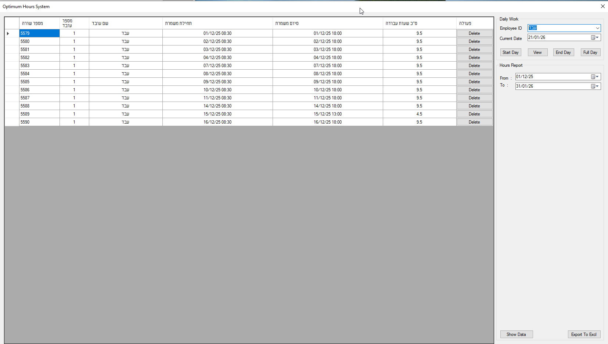

# Hours Manager 🕐

A professional employee time tracking and work hours management system built with Visual Basic .NET and Windows Forms.


## 📋 Overview

Hours Manager is a desktop application designed to help businesses track employee work hours efficiently. The application provides an intuitive interface for employees to check in and out, view their work history, and export reports to Excel.

## ✨ Features

### Core Functionality
- **Check-In/Check-Out System**: Simple one-click time tracking for employees
- **Multi-Employee Support**: Manage multiple employees with individual tracking
- **Work Hours Calculation**: Automatic calculation of total work hours per shift
- **Date Range Filtering**: View work history between specific dates
- **Data Grid Management**: Interactive table view with inline editing capabilities

### Advanced Features
- **Excel Export**: Export work hours data to Excel spreadsheets (`.xls` format)
- **Full Day Entry**: Quick entry for standard 8:30 AM - 6:00 PM shifts
- **Record Management**: Edit or delete individual work entries
- **Real-time Updates**: Automatic refresh of data after any operation
- **Hebrew Language Support**: Full RTL (Right-to-Left) interface support

## 🛠️ Technology Stack

- **Framework**: .NET Framework 4.0 Client Profile
- **Language**: Visual Basic .NET
- **UI Framework**: Windows Forms (WinForms)
- **Database**: SQL Server
- **Excel Integration**: Microsoft Office Interop (Excel 12.0)
- **Architecture**: Repository Pattern with MVVM principles

## 📁 Project Structure

```
Hours_manager/
├── Hours_manager/
│   ├── Form1.vb                    # Main application form
│   ├── Form1.Designer.vb           # Form designer code
│   ├── Model/
│   │   └── DayHours.vb            # Data model for work hours
│   ├── HoursRepository/
│   │   └── DayHoursRepository.vb  # Data access layer
│   ├── My Project/                 # Project configuration files
│   └── screenshot/                 # Application screenshots
├── Hours_manager.sln               # Visual Studio solution file
└── README.md                       # This file
```

## 🚀 Getting Started

### Prerequisites

- Windows OS (7/8/10/11)
- .NET Framework 4.0 Client Profile or higher
- SQL Server (Express or higher)
- Microsoft Excel (for export functionality)
- Visual Studio 2010 or higher (for development)

### Installation

1. **Clone the repository**
   ```bash
   git clone https://github.com/abdmnsor/Hours_manager.git
   cd Hours_manager
   ```

2. **Configure Database Connection**
   - Open `DayHoursRepository.vb`
   - Update the `connectionString` variable with your SQL Server connection details:
     ```vb
     Public connectionString As String = "Server=YOUR_SERVER;Database=YOUR_DB;Trusted_Connection=True;"
     ```

3. **Create Database Schema**
   ```sql
   CREATE TABLE WorkHours (
       RowNumber INT IDENTITY(1,1) PRIMARY KEY,
       ID INT NOT NULL,
       Name NVARCHAR(100) NOT NULL,
       Check_In DATETIME NOT NULL,
       Check_Out DATETIME NULL,
       TotalWorkHours FLOAT NULL
   );
   ```

4. **Build and Run**
   - Open `Hours_manager.sln` in Visual Studio
   - Build the solution (F6)
   - Run the application (F5)

## 💡 Usage

### Basic Operations

1. **Select Employee**: Choose an employee from the dropdown menu
2. **Check In**: Click the "Start" button when beginning work
3. **Check Out**: Click the "End" button when finishing work
4. **View History**: Select date range and click "View" to see work records
5. **Export Data**: Click "Export" to generate an Excel report

### Managing Records

- **Edit**: Click on any cell in the data grid to modify values
- **Delete**: Click the "Delete" button in the Actions column
- **Add Full Day**: Use the date picker and "Full Day" button to add a standard 9.5-hour shift

## 📊 Database Schema

| Column Name      | Data Type    | Description                          |
|-----------------|--------------|--------------------------------------|
| RowNumber       | INT          | Auto-incrementing primary key        |
| ID              | INT          | Employee ID                          |
| Name            | NVARCHAR     | Employee name                        |
| Check_In        | DATETIME     | Check-in timestamp                   |
| Check_Out       | DATETIME     | Check-out timestamp (nullable)       |
| TotalWorkHours  | FLOAT        | Calculated total hours (nullable)    |

## 🔧 Configuration

### Employee Management

Currently, employees are configured in code. To add new employees, modify the `CBX_employee_id_SelectedIndexChanged` method in `Form1.vb`:

```vb
Case "NewEmployeeName"
    CurrentEmployeeID = 3
    CurrentEmployeeName = "NewEmployeeName"
```

### Default Work Hours

To change the default full-day hours, modify the `InsartFullDay` method in `DayHoursRepository.vb`:

```vb
command.Parameters.AddWithValue("@Check_In", DateTime.Parse(Format(currentday, "yyyy-MM-dd") & " 08:30:00"))
command.Parameters.AddWithValue("@Check_Out", DateTime.Parse(Format(currentday, "yyyy-MM-dd") & " 18:00:00"))
```

## 📸 Screenshots



## 🤝 Contributing

Contributions are welcome! Please follow these steps:

1. Fork the repository
2. Create a feature branch (`git checkout -b feature/AmazingFeature`)
3. Commit your changes (`git commit -m 'Add some AmazingFeature'`)
4. Push to the branch (`git push origin feature/AmazingFeature`)
5. Open a Pull Request

## 📝 License

This project is licensed under the MIT License - see the [LICENSE](LICENSE) file for details.

## 🐛 Known Issues

- Connection string is hardcoded and needs manual configuration
- Employee list is hardcoded in the application
- No user authentication system
- Limited to SQL Server database

## 🔮 Future Enhancements

- [ ] Add user authentication and authorization
- [ ] Implement dynamic employee management (add/edit/delete)
- [ ] Support for multiple database providers
- [ ] Modern UI with Material Design
- [ ] Web-based version
- [ ] Mobile app support
- [ ] Advanced reporting and analytics
- [ ] Overtime calculation
- [ ] Holiday and leave management
- [ ] Email notifications

## 📧 Contact

For questions, issues, or suggestions, please open an issue on GitHub.

---

**Made with ❤️ using Visual Basic .NET**
